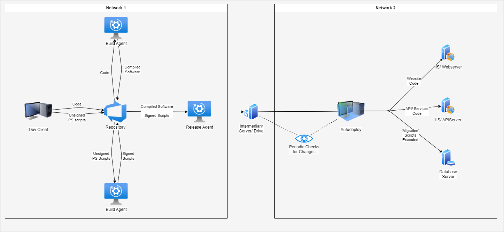

# <span style="color:orange"> Autodeploy

## (Windows only)

### Contents
- [What is Autodeploy](#what-is-autodeploy)
- [How does Autodeploy work](#how-does-autodeploy-work)
- [How do you install Autodeploy](#how-do-you-install-autodeploy)
- [How do you Operate/ Configure Autodeploy](#how-do-you-operate-configure-autodeploy)
- [Dependent Packages](#dependent-packages)
- [Licensing](#licensing)

## <span style="color:orange"> What is Autodeploy

Autodeploy is essentially a directory watching application, with the capability to run powershell scripts.
It is designed such that it needs two-factor configuration, both in it's deployment location, and in what is provided to it via it's watched directories.
The idea here is to provide a pseudo-pipeline, such that an actual CICD pipeline can provide artefacts and (signed) powershell scripts to a specific cross-network
directory, and have them be picked up by Autodeploy, and in running the powershell scripts it can deploy the provided Artefacts.

## <span style="color:orange"> How does Autodeploy work

Autodeploy works by utilising the [Watchdog Package](https://pypi.org/project/watchdog/), and a number of in-build python packages, to run as a windows service on a server and keep an eye on one or more directories (as defined by use configuration). To this end, when Watchdog detects a `Created` or `Modified` event, it will look for powershell scripts in this new directory (following a strict directory structure), and attempt to run them. These powershell scripts, given they have been written correctly and code-signed, will deploy the new application.



## <span style="color:orange"> How do you install Autodeploy

(Requires Anaconda/Mamba variants)

1. Unzip the code-content, and place it in a known directory.
2. Unzip the conda environment, and put it in your anaconda 'envs' folder
3. Run a cli window (CMD, bash, Anaconda) and change directory `cd` to the code content folder.
4. Run the following commands:
```cmd
    activate autodeploy
    python ./src/service.py install
```
Autodeploy should now be installed as a service on your device.

## <span style="color:orange"> How do you Operate/ Configure Autodeploy

### <span style="color:orange"> Configuring Autodeploy

There are two steps involved with configuring Autodeploy; Configuring the application to watch directories, and configuring your builds to ensure they contain the appropriate files in the appropriate structure.

#### <span style="color:orange"> Configuring Autodeploy Settings

As standard, the Autodeploy applications settings should look like this:
```py
watchdog_app_settings = {
    "query_timer": 1,
    "log_file_directory": "C:\\Projects\\work_autodeploy\\log_files\\"
}

app_list = {
    "application_name": {
        "source_directory": "C:\\Projects\\work_autodeploy\\testbed\\pipeline_output_folder\\application_name",
        "app_name": "application_name",
        "app_type": "fast-api",
    }
}
```

- `watchdog_app_settings` are the standard application settings
    - `query_timer` is how frequently watchdog should query it's target directories for changes. As standard this is set to one (1) second.
    - `log_file_directory` is the target directory that autodeploy should store it's log files. (Not currently in use)
- `app_list` contains the list of applications that watchdog should keep an eye on.
    - `application_name` is the actual name of hte application. This value needs to be used across configuration for any given application
        - `source_directory` is the directory that watchdog needs to watch for changes. This directory is where your new builds need to be sent to.
        - `app_name` is the application name again. This should be consistent with the above 'application_name' value. (to be deprecated)
        - `app_type` is the type of application that autodeploy is looking at. For instance, 'fast-api' or 'react'. (to be deprecated)

Adding a new application would look like this:
```py
watchdog_app_settings = {
    "query_timer": 1,
    "log_file_directory": "C:\\Projects\\work_autodeploy\\log_files\\"
}

app_list = {
    "application_name": {
        "source_directory": "C:\\Projects\\work_autodeploy\\testbed\\pipeline_output_folder\\application_name",
        "app_name": "application_name",
        "app_type": "fast-api",
    },
    "application_name_2": {
        "source_directory": "C:\\Projects\\work_autodeploy\\testbed\\pipeline_output_folder\\application_name_2",
        "app_name": "application_name_2",
        "app_type": "react",
    }
}
```

#### <span style="color:orange"> Configuring Builds

Your builds also need to be configured. Here is an overview of the file structure that should be followed:
> `watched_folder\` is the 'source_directory' value from the previous section '[app configuration](#configuring-autodeploy-settings)'
```
- watched_folder\
    - application_name
        - \build#\
            - \deployment_scripts\
                - \first_time_setup\
                    - 01-script_name.ps1
                    - 02-script_name.ps1
                    - 03-script_name.ps1
                    - ...
                - 01-script_name.ps1
                - 02-script_name.ps1
                - 03-script_name.ps1
                - 04-script_name.ps1
                - ...
                - deployment_settings.json
            - application_name_env.zip
            - application_name_code.zip
```

The `deployment_settings.json` file needs to be configured as follows:
```json
{
        "env_target_directory": "C:\\Projects\\work_autodeploy\\testbed\\d$\\envs\\application_name",
        "code_target_directory": "C:\\Projects\\work_autodeploy\\testbed\\d$\\websites\\application_name"
}
```
- `env_target_directory` is the directory that Autodeploy will deploy any __conda environments__ to
- `code_target_directory` is the directory that Autodeploy will deploy any __code__ to

### <span style="color:orange"> Operating/ Running Autodeploy

Given that you installed Autodeploy as a windows service in the [How do you install Autodeploy](#how-do-you-install-autodeploy) step, you can run either of these commands to run Autodeploy.

#### <span style="color:orange"> Run in Debug Mode
> This will run Autodeploy as a service, but inside of your cli terminal; allowing you to see all the standard outputs life as they occur.
```cmd
python ./src/service.py debug
```
> This can be stopped by pressing `CTRL + C`

#### <span style="color:orange"> Run as a Service (Start the Service)
> This will run the existing installed service
```cmd
python ./src/service.py start
```
> In order to stop the service, you must enter the following command:
```cmd
python ./src/service.py stop
```

#### <span style="color:orange"> Using Windows' Service Manager to Start or Stop the service
1. Run the following command in cmd: `services.msc`
2. Locate `Autodeploy Watchdog` in the services list


3. Right Click on the service, and select either `Start` or `Stop`


## <span style="color:orange"> Dependent Packages

| Package Name | Version | Description | GitHub URL | [SourceRank](https://docs.libraries.io/overview.html#sourcerank) | Shortfalls/Issues [^7_00_03] | Mitigation [^7_00_03] | Modifications [^7_00_05] |
|--|--|--|--|--|--|--|--|
| bzip2 | 1.0.8 |  |  | None | ['repository_present', 'readme_present', 'recent_release', 'stars', 'contributors', 'subscribers', 'all_prereleases', 'any_outdated_dependencies', 'is_deprecated', 'is_unmaintained', 'is_removed'] |  |  |
| ca-certificates=2024.6.2=h56e8100_0 | None |  |  |  |  |  |  |
| conda-pack=0.8.0=pyhd8ed1ab_0 | None |  |  |  |  |  |  |
| libexpat | 2.6.2 |  |  |  |  |  |  |
| libffi | 3.4.2 |  |  | None | ['follows_semver', 'all_prereleases', 'any_outdated_dependencies', 'is_deprecated', 'is_unmaintained', 'is_removed'] |  |  |
| libsqlite | 3.45.3 |  |  | None | ['subscribers', 'all_prereleases', 'any_outdated_dependencies', 'is_deprecated', 'is_unmaintained', 'is_removed'] |  |  |
| libzlib | 1.2.13 |  |  | None | ['follows_semver', 'subscribers', 'all_prereleases', 'any_outdated_dependencies', 'is_deprecated', 'is_unmaintained', 'is_removed'] |  |  |
| openssl | 3.3.1 |  |  | None | ['follows_semver', 'all_prereleases', 'any_outdated_dependencies', 'is_deprecated', 'is_unmaintained', 'is_removed'] |  |  |
| pip | 24.0 |  |  | None | ['follows_semver', 'all_prereleases', 'any_outdated_dependencies', 'is_deprecated', 'is_unmaintained', 'is_removed'] |  |  |
| python | 3.12.3 |  |  | None | ['repository_present', 'readme_present', 'follows_semver', 'stars', 'contributors', 'all_prereleases', 'any_outdated_dependencies', 'is_deprecated', 'is_unmaintained', 'is_removed'] |  |  |
| python_abi | 3.12 |  |  | None | ['follows_semver', 'recent_release', 'one_point_oh', 'stars', 'all_prereleases', 'any_outdated_dependencies', 'is_deprecated', 'is_unmaintained', 'is_removed'] |  |  |
| pywin32=306=py312h53d5487_2 | None |  |  |  |  |  |  |
| pyyaml | 6.0.1 |  |  | None | ['follows_semver', 'recent_release', 'all_prereleases', 'any_outdated_dependencies', 'is_deprecated', 'is_unmaintained', 'is_removed'] |  |  |
| setuptools | 69.5.1 |  |  | None | ['all_prereleases', 'any_outdated_dependencies', 'is_deprecated', 'is_unmaintained', 'is_removed'] |  |  |
| tk | 8.6.13 |  |  | None | ['subscribers', 'all_prereleases', 'any_outdated_dependencies', 'is_deprecated', 'is_unmaintained', 'is_removed'] |  |  |
| tzdata=2024a=h0c530f3_0 | None |  |  |  |  |  |  |
| ucrt | 10.0.22621 |  |  | None | ['basic_info_present', 'repository_present', 'readme_present', 'versions_present', 'follows_semver', 'recent_release', 'one_point_oh', 'dependent_repositories', 'stars', 'contributors', 'subscribers', 'all_prereleases', 'any_outdated_dependencies', 'is_deprecated', 'is_unmaintained', 'is_removed'] |  |  |
| vc | 14.3 |  |  | None | ['follows_semver', 'recent_release', 'one_point_oh', 'subscribers', 'all_prereleases', 'any_outdated_dependencies', 'is_deprecated', 'is_unmaintained', 'is_removed'] |  |  |
| vc14_runtime | 14.38.33130 |  |  |  |  |  |  |
| vs2015_runtime | 14.38.33130 |  |  | None | ['basic_info_present', 'repository_present', 'readme_present', 'stars', 'contributors', 'subscribers', 'all_prereleases', 'any_outdated_dependencies', 'is_deprecated', 'is_unmaintained', 'is_removed'] |  |  |
| watchdog | 4.0.0 |  |  | None | ['subscribers', 'all_prereleases', 'any_outdated_dependencies', 'is_deprecated', 'is_unmaintained', 'is_removed'] |  |  |
| wheel | 0.43.0 |  |  | None | ['one_point_oh', 'subscribers', 'all_prereleases', 'any_outdated_dependencies', 'is_deprecated', 'is_unmaintained', 'is_removed'] |  |  |
| xz | 5.2.6 |  |  | None | ['subscribers', 'all_prereleases', 'any_outdated_dependencies', 'is_deprecated', 'is_unmaintained', 'is_removed'] |  |  |
| yaml | 0.2.5 |  |  | None | ['repository_present', 'readme_present', 'one_point_oh', 'stars', 'contributors', 'subscribers', 'all_prereleases', 'any_outdated_dependencies', 'is_deprecated', 'is_unmaintained', 'is_removed'] |  |  |

## <span style="color:orange"> Licensing

MIT License

Copyright (c) 2024 Lee Measures

Permission is hereby granted, free of charge, to any person obtaining a copy
of this software and associated documentation files (the "Software"), to deal
in the Software without restriction, including without limitation the rights
to use, copy, modify, merge, publish, distribute, sublicense, and/or sell
copies of the Software, and to permit persons to whom the Software is
furnished to do so, subject to the following conditions:

The above copyright notice and this permission notice shall be included in all
copies or substantial portions of the Software.

THE SOFTWARE IS PROVIDED "AS IS", WITHOUT WARRANTY OF ANY KIND, EXPRESS OR
IMPLIED, INCLUDING BUT NOT LIMITED TO THE WARRANTIES OF MERCHANTABILITY,
FITNESS FOR A PARTICULAR PURPOSE AND NONINFRINGEMENT. IN NO EVENT SHALL THE
AUTHORS OR COPYRIGHT HOLDERS BE LIABLE FOR ANY CLAIM, DAMAGES OR OTHER
LIABILITY, WHETHER IN AN ACTION OF CONTRACT, TORT OR OTHERWISE, ARISING FROM,
OUT OF OR IN CONNECTION WITH THE SOFTWARE OR THE USE OR OTHER DEALINGS IN THE
SOFTWARE.